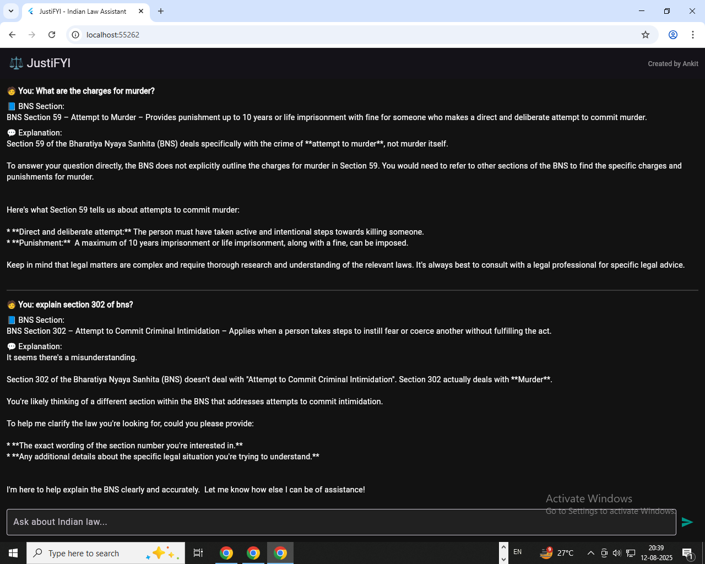

# ⚖️ JustiFYI: Indian Law Assistant (Frontend)

A cross-platform **Flutter app** that helps users ask questions about Indian criminal law.  
It connects to a backend API that finds relevant **Bharatiya Nyaya Sanhita (BNS)** sections and explains them in simple language using AI.

---

## 📱 Features

- 🎨 **Modern Dark Theme UI** for a sleek experience  
- 💬 Ask **legal questions in natural language**  
- 🔗 Connects to a **Flask + AI embeddings backend**  
- 📄 Displays **relevant BNS sections + AI-generated explanation**  
- ⚡ Real-time query sending, responses & loading indicators  
- 🌐 Runs on **Android · iOS · Web · Desktop**

---

## Demo here!!!!

🚀 **Try the live app here:** [JustiFYI Frontend (Hugging Face)](https://huggingface.co/spaces/ankitkumariiserb/legal_chatbot_frontend)  

Backend API: [JustiFYI Backend (Hugging Face)](https://huggingface.co/spaces/ankitkumariiserb/legal_chatbot_backend)

## 🧰 Tech Stack

- **Flutter 3.x (Dart)**  
- `http` for REST API calls  
- State management via `provider` / `setState`  
- Backend powered by **Flask · Hugging Face · Sentence Transformers · Groq API**

---

## 📂 Project Structure

law_frontend/
├── lib/
│ ├── main.dart # Entry point
│ ├── screens/ # UI Screens
│ └── services/ # API calls
├── assets/ # Images or static files
├── pubspec.yaml # Flutter dependencies
├── android/ / ios/ / web/ # Platform-specific code
└── README.md

---

## 🔗 Related Repository

👉 https://github.com/AnkitKumarIISERB/law_backend

---

## 📜 License

This project is licensed under the MIT License.

---
